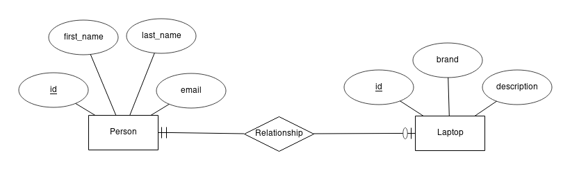
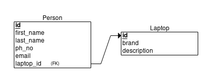

# Hibernate (One to One Relationship)
## Abstract
> You have to use **Hibernate** when we want to make CRUD operations in relational database server using Java code.
> If you have _NEVER_ done a project with the basic connectivity between **Java and MySQL Server**, I suggest you learning [this](https://www.javatpoint.com/example-to-connect-to-the-mysql-database) first.

## About
- [X] CRUD with Hibernate
- [X] Insert data using Hibernate
- [X] Fetch data using Hibernate
- [X] Update data using Hibernate
- [X] Delete data using Hibernate
- [X] ON DELETE SET NULL
- [ ] ON DELETE CASCADE

## What is Hibernate?
- [About Hibernate ORM](https://hibernate.org/orm/)
- Hibernate ORM (Hibernate in short) is an object-relational mapping tool for the Java programming language. It provides a framework for mapping an object-oriented domain model to a relational databases like Oracle, MySQL, MS SQL, etc. Hibernate also provides data query and retrieval facilities.
- Hibernate provides transparent persistence for Plain Old Java Objects (POJOs). The only strict requirement for a persistent class is a no-argument constructor, though not necessarily (public) because the function of DTO still stands.
- Hibernate provides HQL query i.e., same query for every relational database server.

# What is DAO?
- DAO(Data Access Object) is the relationship between SQL Server and Java Object. It fetches the data from database and store it in Java Object.

# What is DTO?
- DTO(Data Transfer Object) is the carrier of data of an object. In Hibernate, when we get a method from dao, **Session** of Hibernate is closed and lead to LazyInitializationException. So basically, DTO saves and use to transfer data of DAO.

## Setting up the project
- Press Alt+Shift+N and create _Maven Project_.
- Add the following dependencies in pom.xml.
```
<!-- https://mvnrepository.com/artifact/org.hibernate/hibernate-entitymanager -->
<dependency>
    <groupId>org.hibernate</groupId>
    <artifactId>hibernate-entitymanager</artifactId>
    <version>5.4.7.Final</version>
</dependency>
	
<!-- https://mvnrepository.com/artifact/mysql/mysql-connector-java -->
<dependency>
    <groupId>mysql</groupId>
    <artifactId>mysql-connector-java</artifactId>
    <version>8.0.18</version>
</dependency>
```
- Add [hibernate.cfg.xml](https://docs.jboss.org/hibernate/orm/3.3/reference/en/html/session-configuration.html) under src/main/java
- If you didn't add
```
"<property name="hibernate.hbm2ddl.auto">update</property>"
```
in hibernate.cfg.xml, Hibernate won't generate the table in your relational database server. But you can write SQL query and create it yourself.
- If you change its value to "create", Hibernate will drop the table and create a new table whenever you run the program.
- With HibernateUtils, get the connection between your database server and Java.

## Diagrams
- ER Diagram

- Relational Schema

- SQL Query
<pre>
CREATE TABLE laptop
(
	id BIGINT AUTO_INCREMENT NOT NULL,
	brand VARCHAR(50),
	description VARCHAR(255),
	PRIMARY KEY (id)
);

CREATE TABLE person
(
	id BIGINT AUTO_INCREMENT NOT NULL,
	first_name VARCHAR(20),
	last_name VARCHAR(20),
	ph_no VARCHAR(20),
	email VARCHAR(25),
	laptop_id BIGINT,
	PRIMARY KEY (id),
	FOREIGN KEY (laptop_id) REFERENCES laptop(id) ON DELETE SET NULL
);
</pre>

## Java POJO for above diagrams
- Hibernate will create table in database server with the following POJO. Pretty Easy, right?
```
public class Person {
	private Long id;
	private String name;
	private String email;
	private String ph_no;
	
	//getters and setters
}
```
- But We're not done yet! We need to signals the Hibernate with the following annotations.
```
@Entity
@Table(name="person")
public class Person {
	@Id
	@GenerateValue(strategy=GenerationType.IDENTITY)
	private Long id;
	
	@Column(name="name");
	private String name;
	
	@Column(name="email");
	private String email;
	
	@Column(name="ph_no");
	private String phNo;
}
```

## Explanation of Annotations
- **@Entity**
  - To signals Hibernate that this is an Entity.
- **@Table(name="custom_name")**
  - To signals Hibernate that this is the table. If you only use **@Table**, Hibernate will automatically set the name with the name of the Java Class but will lowercase characaters i.e., "person."
  - **More with @Table annotation**
    - **@UniqueConstraint** is used when the columns cannot have duplicate values. Or you can set it in **@Column(unique=true)** and default is false.
```
@Table(name = "person", uniqueConstraints = {
		@UniqueConstraint(
				columnNames = {"id", "email", "ph_no"}
		)
})
```
- **@Id**
  - To signals Hibernate that this is an ID.
  - Use data type Long rather than Integer. because of
     - Integer = (−32,767 to +32,767) range. 16 bits in size.
     - Long = (−2,147,483,647 to +2,147,483,647) range. 32 bits in size.
- **@GenerateValue(strategy=GenerationType.IDENTITY)**
  - To signals Hibernate that this ID will auto increment its value.
- **@Column(name="custom_name")**
  - To signals Hibernate that this is a column.
  - **More with @Column annotation**
    - unique (default=false)
    - updatable (default=true)
    - nullable (default=true)
    - length (default=255)
    - [precision](https://stackoverflow.com/questions/4078559/how-to-specify-doubles-precision-on-hibernate)
    - [columnDefinition](https://stackoverflow.com/questions/16078681/what-properties-does-column-columndefinition-make-redundant)
    - [scale](https://stackoverflow.com/questions/4078559/how-to-specify-doubles-precision-on-hibernate)
    
## Explaining Entities in Project
- We get the **One-To-One-Relationship** with the following codes.
<table style="width:100%">
  <tr>
    <th>Person Entity</th>
    <th>Laptop Entity</th> 
  </tr>
  <tr>
    <td>
    <pre>
    @OneToOne(cascade = CascadeType.ALL)
    @JoinColumn(name = "laptop_id")
    private Laptop laptop;
    </pre>
    </td>
    <td>
    <pre>
    @OneToOne(mappedBy = "laptop")
    private Person person;
    </pre>
    </td>
  </tr>
  <tr>
    <td>
    Creating foreign key of Laptop.
    </td>
    <td>
    "mappedBy" tells the Hibernate that the foreign key of this table is in Person Entity;
    </td>
  </tr>
</table>

- There are 5 cascade types; DETACH, MERGE, PERSIST, REFERSH and REMOVE. In here, we cascade with all of them i.e., ALL.
- It's not a good idea to use **ALL** but if we didn't use it, it gives a problem in data persistance. So, I **recommended** to use **ALL**.
- The word "cascade" means it's connected. By the time, you remove a person, it will also remove the laptop which is in relationship with that person.
- But we can fix it using @PreRemove. As by definition of its name, it removes some property before deleting a row.
```
@PreRemove
public void ignoreRemovingLaptopWhenDeletingAPerson() {
	laptop = null;
}
```
- Before deleting a person, we temporarily remove the laptop in relationship with that person by setting laptop to null.
- So, when person is removed, laptop is not removed from the table. That's how we violates the cascade type ALL. That's how we fix it!

## Creating yourself ON DELETE SET NULL with Hibernate
- We're gonna create ON DELETE SET NULL function for every database server. So, we have to use HQL Query for that. I'm not gonna explain my Java code here. Just try to understand it yourself. You can use it in anywhere. I'll just tell you how you can use it.
- We're gonna set the foreign key of laptop in person table to null when removing laptop. So, this is in Laptop Entity.
- Here's how it works. Before deleting a laptop, we update the foreign key of laptop to null which is in person table using @PreRemove annotation.
```
@PreRemove
public void onDeleteSetNullToThisForeignKeyInPerson() {
	DependencyRegistry dependency = DependencyRegistry.getInstance();
	LaptopDao dao = (LaptopDao) dependency.getInstance(LaptopDao.class);
	dao.onDeleteSetNull(Person.class, super.getId());
}
```
- There're 2 parameters in onDeleteSetNull method. The first parameter needs the class containing the foreign key and the second one needs the id of deletion.
- We don't execute Hibernate in Entity. But this is the only way to get it easily. Or you will have to update the foreign key id in the other table everytime before you make a deletion.

## Electronics Engineer-cum-J2EE Backend Developer ##
-  Created by - Aye Chan Aung Thwin
