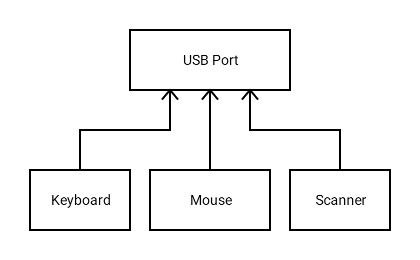

# Hibernate (One to One Relationship)
## Abstract
> You have to use **Hibernate** when we want to make CRUD operations in relational database server using Java code.
> If you have _NEVER_ done a project with the basic connectivity between **Java and MySQL Server**, I suggest you learning [this](https://www.javatpoint.com/example-to-connect-to-the-mysql-database) first.

## About
- Java Generics
- [X] CRUD with Hibernate
- [X] Insert data using Hibernate
- [X] Fetch data using Hibernate
- [X] Update data using Hibernate
- [X] Delete data using Hibernate
- [X] ON DELETE SET NULL
- [ ] ON DELETE CASCADE

## Introduction to Hibernate
- [Press here if you're beginner to Hibernate!](https://github.com/AyeChanAungThwin/1HibernateIntroWithoutRs)

## Diagrams
- ER Diagram

- Relational Schema

- SQL Query
<table style="width:100%">
  <tr>
    <th>laptop table</th>
    <th>person table</th> 
  </tr>
  <tr>
    <td>
    <pre>
CREATE TABLE laptop
(
id BIGINT AUTO_INCREMENT NOT NULL,
brand VARCHAR(50),
description VARCHAR(255),
PRIMARY KEY (id)
);
    </pre>
    </td>
    <td>
    <pre>
CREATE TABLE person
(
id BIGINT AUTO_INCREMENT NOT NULL,
first_name VARCHAR(20),
last_name VARCHAR(20),
ph_no VARCHAR(20),
email VARCHAR(25),
laptop_id BIGINT,
PRIMARY KEY (id),
FOREIGN KEY (laptop_id) REFERENCES laptop(id) ON DELETE SET NULL
);
    </pre>
    </td>
  </tr>
</table>

## Explaining Entities in Project
- We get the **One-To-One-Relationship** with the following codes.
<table style="width:100%">
  <tr>
    <th>Person Entity</th>
    <th>Laptop Entity</th> 
  </tr>
  <tr>
    <td>
    <pre>
    @OneToOne(cascade = CascadeType.ALL)
    @JoinColumn(name = "laptop_id")
    private Laptop laptop;
    </pre>
    </td>
    <td>
    <pre>
    @OneToOne(mappedBy = "laptop")
    private Person person;
    </pre>
    </td>
  </tr>
  <tr>
    <td>
    Creating foreign key of Laptop.
    </td>
    <td>
    "mappedBy" tells the Hibernate that the foreign key of this table is in Person Entity;
    </td>
  </tr>
</table>

- There are 5 cascade types; DETACH, MERGE, PERSIST, REFERSH and REMOVE. In here, we cascade with all of them i.e., ALL.
- It's not a good idea to use **ALL** but if we didn't use it, it gives a problem in data persistance. So, I **recommended** to use **ALL**.
- The word "cascade" means it's connected. By the time, you remove a person, it will also remove the laptop which is in relationship with that person.
- But we can fix it using @PreRemove. As by definition of its name, it removes some property before deleting a row.
```
@PreRemove
public void ignoreRemovingLaptopWhenDeletingAPerson() {
	laptop = null;
}
```
- Before deleting a person, we temporarily remove the laptop in relationship with that person by setting laptop to null.
- So, when person is removed, laptop is not removed from the table. That's how we violates the cascade type ALL. That's how we fix it!

## Java Generics
- Generics are a facility of generic programming that were added to the Java programming language in 2004 within version J2SE 5.0. 
- Generics provide compile-time type safety that allows programmers to catch invalid types at compile time.
- In this project, I separated layers and class like **SpringBoot** and so it will help you when you're moving to **Spring** or **SpringBoot** frameworks. For controllers, we need **PersonController and LaptopController** classes for Person and Laptop. There're some methods for some functions but different types of objects. Suppose you have many entities, you will have to write the same code again and again if you don't use this. In **Business layer**, you have to write Service for both Person and Laptop twice. If you used generics, you can just inherited from an abstract class and implement the required methods with the help of an IDE. The job is done faster!
- The aspect compile-time type safety was not fully achieved, since it was shown in 2016 that it is not guaranteed in all cases. It's up to your codes. For example, you pass the correct type but the class has empty functionality and can't work.

## Creating yourself ON DELETE SET NULL with Hibernate
- We're gonna create ON DELETE SET NULL function for every relational database server. So, we have to use HQL Query for that. I'm not gonna explain my Java code here. Just try to understand it yourself. You can use it in anywhere. I'll just tell you how you can use it.
- We're gonna set the foreign key of laptop in person table to null when removing laptop. So, this is in Laptop Entity.
- Here's how it works. Before deleting a laptop, we update the foreign key of laptop to null which is in person table using @PreRemove annotation.
```
@PreRemove
public void onDeleteSetNullToThisForeignKeyInPerson() {
	DependencyRegistry dependency = DependencyRegistry.getInstance();
	LaptopDao dao = (LaptopDao) dependency.getInstance(LaptopDao.class);
	dao.onDeleteSetNull(Person.class, super.getId());
}
```
- There're 2 parameters in onDeleteSetNull method. The first parameter needs the class containing the foreign key and the second one needs the id of deletion.
- We don't execute Hibernate in Entity. But this is the only way to get it easily. Or you will have to update the foreign key id in the other table everytime before you make a deletion.

## Program to interfaces, not implementation
> Okay, you might wanna know what's that mean in my code.


> The idea is to use the same information or job with one interface.
- Just like the following...
  - Cars, Motobike and Trishaws are the same type what we called vehicle. Whatever, you use one of these, you will have to drive it. We use this in the same procedure. Okay, what's gonna happen if we use this? Just keep reading it.


> The idea is to create an extendsible for modern technology.
-  In eariler years, there're different ports for keyboard, mouse, etc. So, guess what, whenever the new device is released, we have to installed a new port. Well, that's not a good idea. So, nowadays, it has changed and use the USB port as the general port. External peripherials like keyboard, mouse, printers, scanners, etc can be connected with the same USB port. If you're are a MacBook user, you're still buying for extension because they only care how to make laptop thinner and smaller. Genius from Apple does it by changing with Type-C ports. Not working without buying an extension if you wanna connect your external perpherials like wireless laptop with USB port.


> For more information
- What do you think how java connects different database servers. Yes, indeed. Java uses interface to extends modern technology. If there's a new database server, it connects over **Connection Interface**, so it can connects with every database servers.
  - Java Code connecting with JDBC to database server.
```
Connection con = DriverManager.getConnection(jdbcUrl, connectionProps);
```
  - JDBC Architecture


## Electronics Engineer-cum-J2EE Backend Developer ##
-  Created by - Aye Chan Aung Thwin
