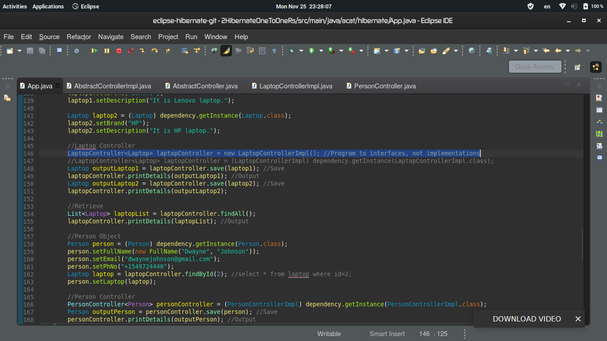
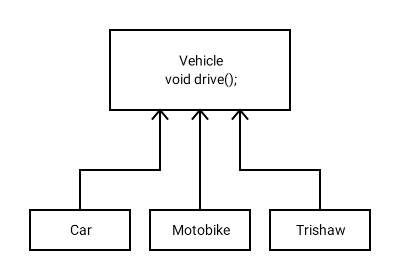
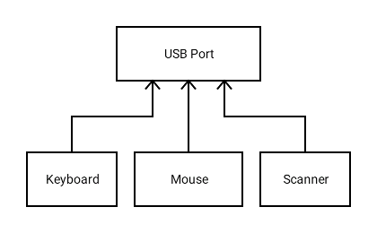
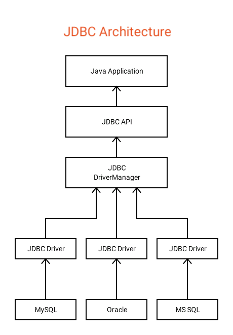

# Hibernate (One-To-One-Relationshipကိုလေ့လာခြင်း)
## အတိုချုပ်
> **Hibernate**ကိုသုံးလိုရင် Database Serverတွေမှာလိုတဲ့ CRUD(Create, Retrieve, Update, Delete) operationsတွေကို Java Codeကနေ တိုက်ရိုက်ခိုင်းလို့ရပါတယ်။
> **Javaနဲ့ MySQL Server**ကြားမှာ _တခါမှ_ connectionချိတ်ပြီး မစမ်းဖူးသေးရင်တော့ [ဒါကိုနှိပ်ပြီး](https://www.javatpoint.com/example-to-connect-to-the-mysql-database) အရင်လေ့လာစေချင်ပါတယ်။

## လေ့လာရမယ့်အကြောင်း
- [X] CRUD with Hibernate
- [X] Insert data using Hibernate
- [X] Fetch data using Hibernate
- [X] Update data using Hibernate
- [X] Delete data using Hibernate
- [X] ON DELETE SET NULL
- [ ] ON DELETE CASCADE

## Hibernateကိုမိတ်ဆက်ခြင်း
- [Hibernateကိုခုမှ စပြီးလေ့လာတာဆိုရင် ဒီကစပြီး လေ့လာပါ](https://github.com/AyeChanAungThwin/1HibernateIntroWithoutRs)

## Diagramများ
- ER Diagram

- Relational Schema

- SQL Query
<table style="width:100%">
  <tr>
    <th>laptop table</th>
    <th>person table</th> 
  </tr>
  <tr>
    <td>
    <pre>
CREATE TABLE laptop
(
id BIGINT AUTO_INCREMENT NOT NULL,
brand VARCHAR(50),
description VARCHAR(255),
PRIMARY KEY (id)
);
    </pre>
    </td>
    <td>
    <pre>
CREATE TABLE person
(
id BIGINT AUTO_INCREMENT NOT NULL,
first_name VARCHAR(20),
last_name VARCHAR(20),
ph_no VARCHAR(20),
email VARCHAR(25),
laptop_id BIGINT,
PRIMARY KEY (id),
FOREIGN KEY (laptop_id) REFERENCES laptop(id) ON DELETE SET NULL
);
    </pre>
    </td>
  </tr>
</table>
   
## Projectမှာပါသော Entityများကို ရှင်းလင်းခြင်း
- We get the **One-To-One-Relationship** with the following codes.
<table style="width:100%">
  <tr>
    <th>Person Entity</th>
    <th>Laptop Entity</th> 
  </tr>
  <tr>
    <td>
    <pre>
    @OneToOne(cascade = CascadeType.ALL)
    @JoinColumn(name = "laptop_id")
    private Laptop laptop;
    </pre>
    </td>
    <td>
    <pre>
    @OneToOne(mappedBy = "laptop")
    private Person person;
    </pre>
    </td>
  </tr>
  <tr>
    <td>
    Laptopအတွက် foreign keyတည်ဆောက်ခြင်း
    </td>
    <td>
    "mappedBy"ဆိုတဲ့ keywordက ဒီlaptopရဲ့ foreign keyက Person Entityမှာရှိတယ်လို့ ပြောတာပါ။
    </td>
  </tr>
</table>

- Cascade ၅မျိုးရှိပါတယ် DETACH, MERGE, PERSIST, REFERSHနဲ့ REMOVEပါ။ ဒီမှာကတော့ အဲ့ဒါအကုန်လုံးကို ALLနဲ့သုံးထားပါတယ်။
- **ALL**ကသုံးတိုင်းမကောင်းပေမယ့် မသုံးပြန်ရင်လည်း dataသွင်းတဲ့အချိန်မှာ ပြဿနာဖြစ်ပြန်ကော။ ဆိုတော့ **ALL**ကိုသုံးပါလို့**recommended**ပေးပါတယ်။
- "Cascade"ဆိုတာ ချိတ်ထားတယ်လို့ဆိုလိုတာပါ။ ချိတ်ထားတဲ့အတွက် personကို removeလုပ်ပေမယ့်လည်း တစ်ဖက်ကrelationshipဖြစ်နေတဲ့ laptopကပါ လိုက်ပျက်ပါမယ်။
- ဒါပေမယ့် ဒီလိုမဖြစ်အောင်@PreRemoveသုံးပြီး ပြင်လို့ရပါတယ်။ သူ့နာမည်အတိုင်း မဖျက်ခင် ဘာကိုအရင်ဖျက်မယ်ဆိုတာကို ရေးပေးရတာပါ။
```
@PreRemove
public void ignoreRemovingLaptopWhenDeletingAPerson() {
	laptop = null;
}
```
- personတစ်ယောက်ကို deleteမလုပ်ခင် သူနဲ့ relationshipချိတ်နေတဲ့ laptopကို nullထည့်ပေးလိုက်တယ်။
- ဒါကြောင့်မို့ personကို ဖျက်တဲ့အချိန်မှာ သူနဲ့သက်ဆိုင်နေတဲ့ laptopက မပျက်ဘဲကျန်ခဲ့လိမ့်မယ်။ ဒီလိုနည်းနဲ့ cascade type ALLကို ပြုပြင်လိုက်တာပါ။

## ON DELETE SET NULLကို Hibernateမှာသုံးလို့ရအောင် ပြုလုပ်ခြင်း
- Relational Database Serverတိုင်းအတွက် ON DELETE SET NULLသုံးလို့ရအောင်လုပ်ကြမယ်ဆိုတော့ ကျွန်တော်တို့က HQLကိုသုံးမှ အဆင်ပြေမယ်။ ကျွန်တော်ရေးထားတဲ့ Codeကိုတော့ မရှင်းပြတော့ဘူး၊ နားလည်ချင်ရင် ကိုယ့်ဘာကိုယ်သာဖတ်ကြည့်ပါ၊ ဘယ်လိုသုံးရမလဲဆိုတာပဲရှင်းပြပါမယ်။
- လုပ်ရမှာက laptopကို ဖျက်တဲ့အချိန်မှာ ဖျက်လိုက်တဲ့ laptopကိုချိတ်ထားတဲ့ personထဲက foreign key idကို nullဖြစ်အောင် updateလုပ်ရမှာလေ။
- ဘယ်လိုလုပ်လိုက်သလဲဆိုတော့ မဖျက်ခင်မှာ @PreRemoveကို သုံးပြီး တစ်ဖက်က foreign key idကို ဖျက်လိုက်တဲ့ laptop idတူတဲ့ နေရာတိုင်းကို updateလုပ်လိုက်တယ်။
```
@PreRemove
public void onDeleteSetNullToThisForeignKeyInPerson() {
	DependencyRegistry dependency = DependencyRegistry.getInstance();
	LaptopDao dao = (LaptopDao) dependency.getInstance(LaptopDao.class);
	dao.onDeleteSetNull(Person.class, super.getId());
}
```
- onDeleteSetNullဆိုတဲ့ methodမှာ parameter၂ခုပဲပါတယ်။ ပထမတစ်ခုက foreign keyပါတဲ့ classကို ထည့်ပေးရမှာဖြစ်ပြီးတော့၊ ဒုတိယတစ်ခုကတော့ ခုdeleteလုပ်နေတဲ့ idကို ထည့်ပေးရမှာပါ။
- Entityထဲမှာ Hibernateကို ခုလို Executeလုပ်လေ့မရှိဘူးဆိုပေမယ့် ဒါကိုလိုချင်ရင် ဒီနည်းက တစ်ခုတည်းသော နည်းလမ်းပါပဲ။ အဲ့လိုမှမဟုတ်ရင်တော့ တစ်ခုခုဖျက်မယ်ဆိုတိုင်း ကိုယ်တိုင် updateလုပ်ပြီးမှ ဖျက်ပေါ့။

## Program to interfaces, not implementation
> အဲ့ဒါက ဘာကိုပြောတာလဲဆိုတာ သိချင်နေမှာပေါ့။


> ဆိုလိုချင်တာက အမျိုးအစားတူတဲ့အရာတွေစုထားတာမျိုး
- ဒီလိုမျိုးပေါ့...
  - ယာဉ်ဆိုတဲ့ အမျိုးအစားမှာ ကား၊ ဆိုင်ကယ်၊ သုံးဘီး အကုန်ပါတယ်။ ဘာကိုပဲသုံးသုံး မောင်းရမှာပဲ။ လုပ်ရမယ့် အလုပ်တူနေတာမျိုးတွေမှာ အသုံးဝင်ပါတယ်။ ဒီလိုလုပ်လို့ ဘာထူးခြားလာမှာလဲ? အောက်မှာ ဆက်ကြည့်ပါ။


> နောင်အနာဂါတ်မှာ ဖြစ်ပေါ်လာမယ့် နည်းပညာကို ဆက်ပြီး ထောက်ပံ့ပေးလို့ရအောင်လို့ သုံးတာလည်းပါတယ်။
- အရင်တုန်းကဆိုရင် keyboardအတွက် ပလတ်ပေါက်က သတ်သတ်၊ Mouseအတွက်ကသတ်သတ်ဖြစ်နေတော့ Deviceအသစ်တစ်ခုပေါ်လာတိုင်း ထိုးဖို့ ပလတ်တစ်ခုလိုသလိုဖြစ်နေတယ်။ အဲ့ဒါကြောင့် ဒီလို ပလတ်တွေ လျှောက်ခွဲတာမျိုးက ကောင်းတဲ့လုပ်ရပ်မဟုတ်ဘူး။ ခုတော့ ဒါတွေကို ပြောင်းလဲပစ်လိုက်ပြီ deviceအားလုံးကို USBပေါက်မှာ ထိုးလို့ရတယ်။ USB Portကို ဘုံပလတ်တစ်ခုလို သတ်မှတ်လိုက်တာပေါ့။ ဒါပေမယ့် ခင်ဗျားက MacBookသုံးနေတဲ့သူဆိုရင်တော့ ဒီပြဿနာတွေက ကြုံဦးမှာပဲ။ သူတို့က laptopကို သေးဖို့ ပါးဖို့ပဲ ဂရုစိုက်တာလေ။ ဆိုတော့ Appleက ဉာဏ်ကြီးရှင်တွေက MacBookမှာ Type-Cပလတ်တွေ သုံးလိုက်ကော။ အဲ့တော့ Wireless Mouseလည်း သုံးမရ၊ သုံးချင်ရင် extensionကြီး ခံသုံးရပြန်ကော။ အဲ့လို ပြဿနာတွေရှိတယ်။


> ထပ်ဆောင်းသိစေရန်
- Javaက မတူညီတဲ့ Database Serverတွေကို ဘယ်လိုချိတ်တယ်လို့ထင်လဲ။ သေချာတာပေါ့။ Javaက Interfaceကို သုံးပြီး နောက်ပေါ်လာမယ့် နည်းပညာတွေကိုပါ သုံးနိုင်အောင်လုပ်ထားတယ်။ သူက Connectionဆိုတဲ့ Interfaceကိုပဲ သုံးပြီး JDBC APIကနေ ချိတ်တယ်။ ဒါကြောင့် ဘယ်databaseနဲ့ချိတ်ချိတ် ဒီcodeနဲ့ပဲ သုံးလို့ရနေတာပေါ့။ Interfaceသာ မသုံးခဲ့ဘူးဆိုရင် MySqlနဲ့ချိတ်ရင် တစ်မျိုးရေး၊ Oracleဆို တစ်မျိုး၊ databaseတိုင်းကို codeအသစ်တွေလိုက်ရေးရမှာလည်း ဖြစ်သလို တစ်ခုခုလုပ်မယ်ဆို အချိန်လည်း နှောင့်နှေးသွားတာပေါ့။
  - JDBCကနေ database serverကို ချိတ်တဲ့ Java Code.
```
Connection con = DriverManager.getConnection(jdbcUrl, connectionProps);
```
  - JDBC Architecture


## Electronics Engineer-cum-J2EE Backend Developer ##
-  တင်သူ - အေးချမ်းအောင်သွင်
